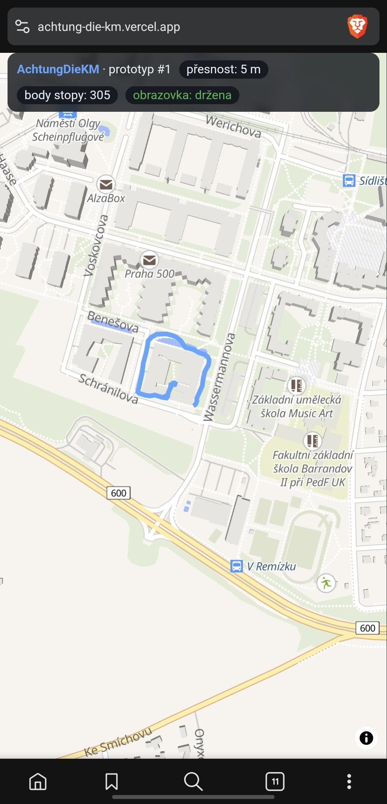
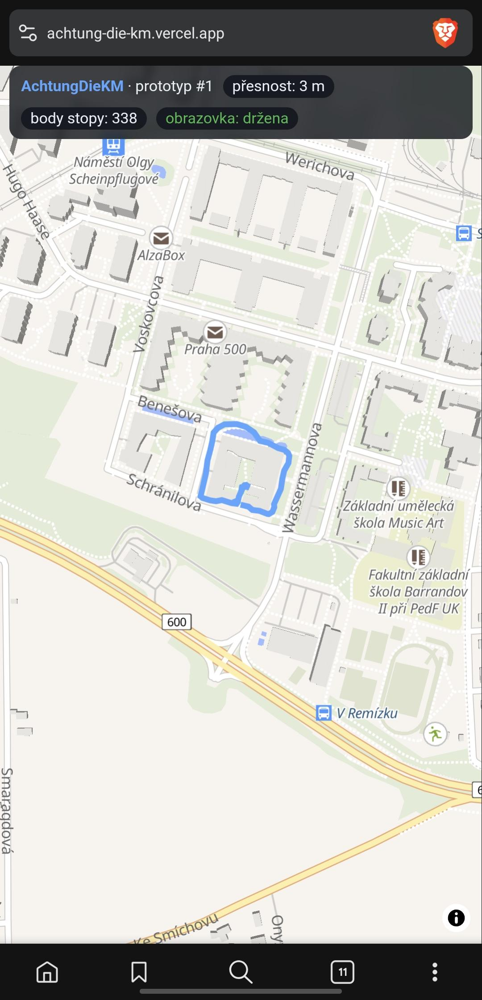

# 📓 Deník vývoje — AchtungDieKM

> Tenhle dokument zachycuje **cestu** vzniku hry: jak jsme postupovali krok za krokem,
> jaká rozhodnutí jsme dělali a proč. Vzniká ve spolupráci člověka a AI (Claude Code).
> Je psaný tak, aby se dal ukázat hráčům i lidem, které zajímá, *jak se taková hra dá vytvořit*.

Legenda: 🧑 **Wake** = zadavatel (člověk) · 🤖 = AI (Claude Code) · ✅ = hotovo · 🚧 = probíhá
Časy u etap odpovídají **času uložení do Gitu** (commitu) — ukazují reálné tempo.

---

## 🧱 Z čeho je to postavené (technologie)

Aplikace je **webová PWA** — běží v prohlížeči na mobilu i PC a jde „nainstalovat" na plochu jako appka.
Jeden kód pro všechny platformy, žádný nativní Android/iOS.

**Frontend (běží v telefonu/prohlížeči)**
- **TypeScript** — hlavní jazyk (JavaScript s typovou kontrolou).
- **React 18** — uživatelské rozhraní · **Vite 5** — build a dev server · **React Router** — přepínání obrazovek.
- **vite-plugin-pwa** (Workbox) — instalace na plochu, offline cache, service worker.
- **HTML + CSS** — vlastní styly, bez velkého frameworku.

**Mapy a geometrie**
- **MapLibre GL JS** — interaktivní mapa (open-source, bez placených klíčů) · podklady z **OpenFreeMap**.
- **OpenStreetMap + Overpass API** — odkud se stahují reálné ulice a chodníky do plánu.
- **Turf.js** + vlastní výpočty v TS — přichycení na ulici (snapping), vzdálenosti (haversine), detekce kolizí, délka trasy.

**Backend a data — Supabase** (klient + Supabase, žádný vlastní server)
- **PostgreSQL** (+ **PostGIS** pro geodata) — hráči, plány, hry, výsledky, stopy.
- **Realtime** — živé sdílení poloh mezi telefony (WebSocket broadcast).
- **SQL funkce (RPC)** — herní logika na serveru (založení/spuštění/vyhodnocení hry).

**Pomocné nástroje & nasazení**
- **Python** (ReportLab) — generování PDF příruček · **Python** (psycopg) + **SQL** — databázové migrace.
- **Git/GitHub** — verzování · **Vercel** — hosting a automatické nasazení (každý push na `main` → živá appka).

> **Jednou větou:** telefon (React/TypeScript PWA) kreslí přes GPS stopu na MapLibre mapě, polohy letí v reálném
> čase přes Supabase Realtime ostatním hráčům, a herní pravidla + výsledky řeší PostgreSQL/PostGIS na Supabase.
> Hostováno na Vercelu. Zajímavost: appka **nemá vlastní server** — logika běží v prohlížeči nebo jako SQL funkce v databázi.

---

## Etapa 0 — Založení projektu a verzování

**Datum a čas:** 2026-06-26, 21:51

- 🧑 Zadání: „Vytvoříme společně mobilní aplikaci, kód i dokumentaci budeme ukládat do Gitu."
- 🤖 Ověřil prostředí: Git nainstalovaný (v2.53), existuje SSH klíč, ale složka projektu byla prázdná a nebyla to Git repo.
- 🧑 Založil si účet a repozitář na GitHubu: `firstwakedown-ui/AchtungDieKM`.
- 🤖 Otestoval připojení — SSH klíč ještě nebyl na GitHubu přidán, ale **HTTPS funguje** a repo existuje (prázdné).
- 🤖 Nastavil Git identitu, inicializoval repozitář, připojil `origin`, vytvořil `README.md` + `.gitignore` a první commit. ✅

**Co jsme se naučili:** Než se začne programovat, je dobré mít **verzování** (Git) a čistou strukturu — každá změna je pak dohledatelná a vratná.

---

## Etapa 1 — Dohoda na postupu (business analýza jako první)

**Datum a čas:** 2026-06-26, ~22:05

- 🧑 Důležité rozhodnutí: „Nejdřív **business analýza** — sepíšeme funkční i nefunkční požadavky, zvalidujeme je, a **teprve potom** programujeme."
- 🤖 Souhlas + návrh procesu: sběr požadavků → roztřídění na **FR/NFR** (s ID a prioritou MoSCoW) → validace → návrh → kód.

**Co jsme se naučili:** Dobrý nápad ještě není hotová hra. **Analýza požadavků** předem šetří hodiny pozdějšího předělávání.

---

## Etapa 2 — Vize a koncept hry

**Datum a čas:** 2026-06-26, 22:12

- 🧑 Popsal nápad: hráči s mobilem chodí po **reálném městě**, GPS kreslí jejich **čáru po ulicích**,
  nesmí opustit chodník, a kdo narazí do cizí čáry, **vypadává**. Server vše kreslí v reálném čase.
- 🤖 Zrekapituloval pochopení („Achtung die Kurve / Tron v reálném městě") a uložil koncept do `docs/01-vize-a-koncept.md`.
- 🤖 Připravil sadu **upřesňujících otázek** (pravidla, území, hráči, přesnost GPS, bezpečnost, platforma), aby z vize vznikly měřitelné požadavky.

**Co jsme se naučili:** Než se napíše řádek kódu, je potřeba **rozumět nápadu do detailu** — a hlavně si ujasnit věci, které na první pohled nejsou vidět (přesnost GPS, bezpečnost hráčů v provozu, výpadky signálu).

---

## Etapa 3 — Sběr požadavků (okruhy A–C) a první draft FR/NFR

**Datum a čas:** 2026-06-26, 23:03

- 🤖 Připojení k Gitu ověřeno i v praxi: úspěšný `git push` na GitHub (`origin/main`). ✅
- 🤖 Sběr požadavků formou **otázek po jedné**, Wake odpovídá. Vyjasnili jsme:
  - **Cíl a kolize:** poslední přeživší bez limitu; mapa jako **graf** (ulice = hrany, křižovatky/náměstí = uzly);
    projetá ulice je trvale zabraná; vyřazení při vjezdu do zabrané ulice, při uvíznutí v uzlu bez výjezdu,
    nebo při nečinnosti > 30 s; křížení v uzlu povoleno přes volné ulice.
  - **Zóny:** admin konfiguruje povolené/zakázané spojnice (parky, parkoviště…); mimo zónu > 30 s = vyřazení, návrat stejným místem.
  - **Setup:** admin kreslí oblast, nastaví spojnice a startovací body; konfigurace se použije pro další zápasy.
  - **Role a účty:** admin vs. hráč; jednoduchý účet (přezdívka + e-mail, přihlášení PINem); uzavřená skupina na pozvánku.
  - **Start zápasu:** hra čeká na všechny na startech → admin dá START → odpočet 10,9,…; mapa ukazuje starty všech.
  - **Území:** centrum Kroměříže, ~0,5 km² (≈ 800×550 m), 5–10 hráčů.
  - **Výstup navíc:** generování **PDF s výsledky**.
- 🤖 Zafixoval do `docs/02-pozadavky.md` (**FR-01…FR-25, NFR-01…NFR-08**, priority MoSCoW předběžně).

**Co jsme se naučili:** Pravidla, která zní jednoduše („nesmíš narazit do čáry"), skrývají spoustu detailů
(co je křižovatka, kdy smím křížit, kdy uvíznu, co mimo zónu). Proto se vyplatí ptát **po jedné** a vše hned zapisovat.

---

## Etapa 4 — Sběr požadavků (okruhy D–F) dokončen

**Datum a čas:** 2026-06-26, 23:18

- 🤖 Dosbírány zbývající okruhy formou otázek po jedné:
  - **Real-time / GPS:** poloha se **přichytává na ulici** (snapping); výpadek řeší **interpolace**,
    ale vyřazení při výpadku > 1 min nebo „skoku" > 200 m. **Anti-cheat se neřeší** (fair play, uzavřená parta).
  - **Bezpečnost:** graf = chodníky i kraje ulic, rozlišit bezpečnost automaticky nejde → **volba bezpečného
    území je na adminovi**; před startem **bezpečnostní upozornění**. Hra je **soukromý sraz kamarádů** v konkrétní den.
  - **Platforma a rozsah:** primárně **Web / PWA**, případně Android, **iOS neřešíme**; první verze = **MVP**.
- 🤖 Doplnil `docs/02-pozadavky.md`: nové FR-26…FR-30, NFR-04…NFR-09, sekce **Rozsah MVP** a body k validaci.

**Co jsme se naučili:** U hry v reálném světě je půlka práce „mimo herní logiku" — přesnost GPS, výpadky signálu
a hlavně **bezpečnost lidí v provozu**. A je rozumné začít **MVP** a ověřit nápad v terénu, než se staví celá hra.

---

## Etapa 5 — Validace požadavků ✅ (business analýza hotová)

**Datum a čas:** 2026-06-26, 23:22

- 🧑 Wake odsouhlasil otevřené body a rozhodl:
  - Časovače i tolerance snappingu **nastavitelné adminem** (default 30 s / 30 s / 30 m).
  - Mapová data: **OpenStreetMap**.
  - Upozornění na slabý signál: **ano** (priorita S).
  - Priority: jádro = Must, PDF = Should, anti-cheat = Won't.
- 🤖 Zapsal do `docs/02-pozadavky.md` (FR-31, NFR-10, finální priority) a označil **validaci za uzavřenou**.

**Co jsme se naučili:** Validace = poslední pojistka, že si zadavatel a vývojář rozumí **stejně**.
Pár drobných rozhodnutí (kdo nastavuje limity, odkud bereme mapu) teď ušetří hádky později.

🎉 **Tímto je business analýza dokončená.**

---

## Etapa 6 — Návrh architektury a volba open-source technologií

**Datum a čas:** 2026-06-26, 23:39

- 🧑 Wake: „Rozjeďme návrh architektury, najdi open-source technologie, co nejvíc sedí na zadání."
- 🤖 Provedl rešerši (2026) a navrhl stack do `docs/03-architektura.md`:
  - **Mapa:** MapLibre GL JS (WebGL, zvládne hodně pohyblivých stop) + dlaždice **OpenFreeMap** (zdarma, bez klíče).
  - **Frontend:** React + Vite + TypeScript jako PWA.
  - **Real-time server:** **Colyseus** (Node/TS) — autoritativní herní server, 1 zápas = 1 room, automatická synchronizace stavu.
  - **Snapping/geometrie:** Turf.js (`nearestPointOnLine`) + rbush (R-tree).
  - **Graf ulic z OSM:** OSMnx + NetworkX (Python, offline příprava) → export JSON pro server.
- 🤖 Upozornil na **klíčové riziko**: PWA přestane hlásit GPS při zhasnuté obrazovce → řešení **Screen Wake Lock** (držet displej),
  fallback nativní Android obal (Capacitor). Nutno ověřit hned v prototypu.
- 🤖 Navrhl model kolizí „**závazek na hranu**" (sedí na logiku X/T křižovatek) a otevřel pár otázek k rozhodnutí.

**Co jsme se naučili:** Volba technologií není o „nejnovějším", ale o tom, co **sedí na konkrétní zadání** —
autoritativní server (Colyseus), GPU mapa (MapLibre) a hotové geo-nástroje (Turf, OSMnx) ušetří měsíce práce.
A u mobilní hry v pohybu je největší riziko často „nudný" detail — tady GPS na pozadí v PWA.

---

## Etapa 7 — Rozhodnutí o architektuře (Supabase + Vercel)

**Datum a čas:** 2026-06-26, 23:47

- 🧑 Wake rozhodl: **React**; kolize podle **projeté části** ulice (ne celé hrany); základ **PWA + rovnou Android APK**;
  hosting **Supabase + Vercel**.
- 🤖 Promítl do `docs/03-architektura.md` a upozornil na zajímavý důsledek:
  - Supabase umí **Postgres+PostGIS** (geo-dotazy = snapping i kolize v DB), **Auth e-mail OTP** (= náš PIN zadarmo),
    **Realtime** (rozesílání stop) a **Edge Functions** (autoritativní logika na každý GPS update).
  - Proto **odpadá samostatný Colyseus/Node server** — autoritu řešíme **událostně**. Pro 5–10 hráčů to stačí.
  - Android APK přes **Capacitor** (kvůli spolehlivému GPS na pozadí).
  - „Projetá část" sedí na PostGIS: stopa = `LINESTRING`, kolize = `ST_Intersects`.

**Co jsme se naučili:** Volba hostingu umí překreslit celou architekturu. Supabase+Vercel nám ubraly jednu velkou
komponentu (vlastní herní server) a daly přihlašování i geo-výpočty „z krabice" — méně kódu, méně provozu.

---

## Etapa 8 — Příprava projektů a kostra kódu

**Datum a čas:** 2026-06-26, 23:56

- 🧑 Wake doplnil rozhodnutí: komunitní bg-geolocation plugin, **GPS 2 Hz**, účty až po prototypu, projekty zatím nemá → připravit.
- 🤖 Zjistil, že na PC zatím **není Node ani Python** (Java 11 je) → instalaci zahrnul do návodu.
- 🤖 Vytvořil **setup návod** `docs/04-setup.md` (instalace nástrojů, založení Supabase + Vercel, bezpečné předání klíčů
  — `service_role` NIKDY do chatu/Gitu).
- 🤖 Založil **kostru projektu**:
  - `app/` — React + Vite PWA, **prototyp #1**: mapa (MapLibre + OpenFreeMap), GPS `watchPosition` ~2 Hz,
    **Screen Wake Lock**, kreslení vlastní stopy.
  - `supabase/schema.sql` — PostGIS tabulky (graf ulic, zápasy, hráči, stopy).
  - `tools/osm/build_graph.py` — stažení pěší sítě z OSM (OSMnx) → GeoJSON.

**Co jsme se naučili:** „Připravit projekt" = nejen kód, ale i **prostředí** (Node, Python) a **bezpečné zacházení s klíči**.
Kostra je schválně malá, ale **spustitelná** — prototyp #1 cílí rovnou na největší riziko (GPS + Wake Lock v terénu).

---

## Etapa 9 — Změna území pro MVP: Praha–Barrandov

**Datum a čas:** 2026-06-27, 00:09

- 🧑 Wake: „Pro MVP použijme mapu Prahy–Barrandova. Kroměříž se použije až později."
- 🤖 Aktualizoval kód i dokumentaci:
  - `app/src/App.tsx` — střed mapy na Barrandov `[14.3735, 50.0235]`.
  - `tools/osm/build_graph.py` — bounding box na Barrandov (cca 50.0200–50.0270 N, 14.3670–14.3800 E).
  - Dokumenty (vize, požadavky, architektura, setup, README) — MVP území = Praha–Barrandov; Kroměříž zůstává v plánu.

**Co jsme se naučili:** Cílová lokalita je jen **konfigurace** (souřadnice + oblast), ne zásah do logiky —
díky tomu, že mapa stojí na obecném grafu z OSM, je změna města otázkou pár hodnot.

---

## Etapa 10 — Vývojové prostředí běží, frontend ověřen

**Datum a čas:** 2026-06-27, 00:22

- 🧑 Firemní notebook bez admin práv → Node nešel klasicky nainstalovat. Wake to vyřešil přes **Scoop**
  (user-level správce balíčků bez admina): **Node v26.4.0**, **npm 11.17.0**, **Python 3.14.6**.
- 🤖 Pozn. k prostředí: nástroj-terminál nečetl aktualizovaný PATH → řešení = na začátku příkazu obnovit PATH z registru
  (`[Environment]::GetEnvironmentVariable('Path','Machine'|'User')`).
- 🤖 `npm install` v `app/` (548 balíčků), ověřil **Vite 5.4.21** a spustil **produkční build** → ✅ `built in 3.48s`,
  PWA service worker vygenerován. Kód prototypu #1 (MapLibre + GPS + Wake Lock) se sestaví.
- 🤖 Uložil `app/package-lock.json` (zámek verzí, i pro Vercel).

**Co jsme se naučili:** Zamčený firemní notebook nemusí být stopka — **Scoop** umí nainstalovat nástroje bez admina.
A první „build prošel" je velký milník: potvrzuje, že celý řetězec (Node → Vite → React → MapLibre) funguje.

---

## Etapa 11 — Backend napojen: Supabase + PostGIS běží

**Datum a čas:** 2026-06-27, 00:39

- 🧑 Spustil prototyp #1 lokálně → mapa Barrandova + kreslení stopy „vypadá super". ✅
- 🧑 Založil **Supabase** projekt, poslal **Project URL** + **anon key**.
- 🤖 Vytvořil lokální `app/.env` (ověřeno, že je v `.gitignore` — klíče se nepushnou).
- 🧑 Spustil `supabase/schema.sql` v SQL Editoru → tabulky založeny (PostGIS zapnuto).
- 🤖 Ověřil **end-to-end spojení**: auth health `200`, REST `GET street_edges` → `200 []`.
  Celý řetězec **appka → Supabase → PostGIS** funguje.

**Co jsme se naučili:** Ověřovat po malých krocích se vyplácí — nejdřív platnost klíče (auth), pak schéma, pak REST dotaz.
Pozn. k bezpečnosti: tabulky zatím bez **RLS** (OK pro prototyp, před ostrým provozem doplnit politiky).

---

## Etapa 12 — PWA nasazena na Vercel, první test v terénu

**Datum a čas:** 2026-06-27, 00:54

- 🤖 Ověřil produkční build včetně `tsc` (`npm run build`) — našel a opravil TS chybu (zbytečný `@ts-expect-error`
  u `navigator.wakeLock`), aby Vercel build nepadl. Uklidil `*.tsbuildinfo` z Gitu.
- 🧑 Založil **Vercel** projekt (root `app/`, env proměnné Supabase) a **nasadil**.
- 🤖 Ověřil běh: `https://achtung-die-km.vercel.app/` → `HTTP 200`, PWA manifest i JS bundle OK.
- 🧑 **Vyrazil na Barrandov vyzkoušet záznam polohy naživo.** 🚶

**Co jsme se naučili:** Lokálně testuj přesně to, co poběží v cloudu — `npm run build` (s `tsc`), ne jen `vite build`.
Jeden zapomenutý typový detail by jinak shodil nasazení. A teď to nejdůležitější: **ověřit hlavní riziko v terénu** (GPS + Wake Lock).

> ⏱️ **Tempo:** od založení repa (21:51) po nasazenou PWA na Vercelu (00:54) uplynuly **~3 hodiny** —
> včetně kompletní business analýzy, návrhu architektury a zprovoznění backendu.

---

## Etapa 13 — První test v terénu ÚSPĚŠNÝ ✅🚶

**Datum a čas:** 2026-06-27, 01:16

- 🧑 Wake se prošel po Barrandově s nasazenou PWA a poslal screenshoty z mobilu.
- 🎯 **Výsledek je výborný:**
  - **Přesnost GPS 3–5 m** mezi paneláky (lepší, než jsme čekali — počítali jsme s 10–30 m).
  - Stopa se **plynule zaznamenávala** (305 → 338 bodů) a hezky kopíruje ulice (smyčka kolem bloku
    mezi ulicemi Benešova / Schránilova / Wassermannova).
  - **Obrazovka držena** celou dobu (Screen Wake Lock funguje).

**Co jsme se naučili:** Největší riziko projektu (GPS + držení obrazovky v PWA) je **ověřené v reálu** —
a přesnost 3–5 m znamená, že snapping na ulice bude fungovat dobře. PWA prozatím **stačí**, nativní Android obal
(Capacitor) zatím nepotřebujeme.

---

## Etapa 14 — Graf ulic Barrandova z OpenStreetMap

**Datum a čas:** 2026-06-27, 01:31

- 🤖 Vytvořil Python venv a nainstaloval **osmnx 2.1.0** — i na velmi novém **Pythonu 3.14** byly všechny geo-balíčky
  dostupné (numpy, pandas, shapely, pyproj, pyogrio).
- 🤖 Upravil `tools/osm/build_graph.py`: stáhne pěší síť Barrandova a vygeneruje **`supabase/import_graph.sql`**
  (uzly přes `ST_MakePoint`, hrany přes `ST_GeomFromText`, idempotentní `truncate`).
- 🤖 Spustil → **40 uzlů, 92 hran** (26,7 KB SQL). Pěší síť té oblasti je menší (hodně zeleně); pro prototyp stačí.
- 🤖 Aktualizoval README (`tools/osm`, `supabase`) s postupem importu.

**Co jsme se naučili:** Stáhnout reálnou mapu ulic je díky **OSMnx** otázka pár řádků — graf (uzly = křižovatky,
hrany = ulice) je přesně to, co potřebujeme pro snapping a kolize. A i bleeding-edge Python 3.14 už měl hotové balíčky.

---

## Etapa 15 — Bezpečné migrace + graf naimportován do PostGIS

**Datum a čas:** 2026-06-27, 02:01

- 🧑 Wake: „Nechce se mi to pořád vkládat do SQL editoru — co kdybych ti dal heslo k DB? Dá se uložit jinak než plaintextem?"
- 🤖 Bezpečnostní zásada: **heslo neposílat do chatu** (zůstalo by v historii). Místo toho **lokální šifrované úložiště**.
- 🤖 Postavil migrační nástroj `tools/db/`:
  - `set-secret.ps1` — uloží connection string **šifrovaně přes Windows DPAPI** (mimo repo, vázané na účet+PC).
  - `migrate.ps1` + `migrate.py` (psycopg) — dešifrují tajemství do paměti a spustí SQL. Heslo se **neloguje ani neukládá v plaintextu**.
- 🧑 Uložil connection string (Session pooler) přes `set-secret.ps1`.
- 🤖 Spustil migrace: `schema.sql` + `import_graph.sql` → DB má **40 uzlů, 92 hran** (ověřeno psycopg).
- 🐛 Zjistil, že REST (anon) vrací prázdno → **Supabase u nových tabulek zapíná RLS**. Doplnil `policies_prototype.sql`
  (veřejné čtení grafu, dočasný anonymní přístup k herním tabulkám) a aplikoval. REST teď vrací data
  (ulice „V Remízku", „Lipová alej"…). ✅

**Co jsme se naučili:** Tajemství (hesla) patří do **šifrovaného úložiště** (DPAPI), ne do chatu/Gitu/plaintextu.
A u Supabase pozor: **nové tabulky mají RLS zapnuté** — bez politik frontend nic nevidí.

---

## Etapa 16 — Graf ulic vykreslený v mapě (prototyp #2)

**Datum a čas:** 2026-06-27, 02:08

- 🤖 Zjistil, že PostGIS přes PostgREST vrací `geom` rovnou jako **GeoJSON** → snadné vykreslení.
- 🤖 Rozšířil `app/src/App.tsx` (prototyp #2): při startu načte ze Supabase **graf ulic** (`street_edges`, `street_nodes`)
  a vykreslí ho jako **oranžovou síť** (hrany = čáry, uzly = kolečka) **pod** modrou stopou hráče. HUD ukazuje počet ulic.
- 🤖 Ověřil produkční build (tsc + vite) → OK; Vercel se přenasadí automaticky z `main`.

**Co jsme se naučili:** Supabase/PostGIS umí vracet geometrii rovnou v GeoJSON, takže napojení mapy na databázi
je pár řádků. Teď je vidět reálná síť ulic Barrandova přímo v appce — základ pro snapping a kolize.

---

- ✅ **Vizuálně ověřeno lokálně** (`npm run dev`): oranžová síť sedí na ulice Barrandova.
  Pozn.: širší ulice (např. *V Remízku*) mají chodník po **obou stranách** jako dvě paralelní hrany —
  tak je OSM mapuje; pro hru OK (případně později sloučit do jedné „logické ulice").
- 🤖 Doplnil `fitBounds` na hrací oblast (mapa neutíká za GPS) — graf je vidět i při testu mimo Barrandov.

## Etapa 17 — Oprava Vercel auto-deploye (e-mail commitu)

**Datum a čas:** 2026-06-27, 02:26

- 🧑 Z Vercel build logu: *„deployment blocked — commit email info@physter.com could not be matched to a GitHub account."*
- 🤖 Příčina: Vercel (Hobby) pouští jen commity, jejichž **autor jde spárovat s GitHub účtem**. `info@physter.com`
  na účtu `firstwakedown-ui` není.
- 🤖 Oprava: nastavil commit e-mail na **GitHub noreply** účtu (`297125557+firstwakedown-ui@users.noreply.github.com`)
  a pushnul nový commit. Vercel ho **spároval a nasadil** (živá stránka má nejnovější build).
- 🤖 Ověřil, že env proměnné (`VITE_SUPABASE_URL`/`ANON_KEY`) jsou v buildu → graf se načte i na Vercelu.

**Co jsme se naučili:** Vercel páruje **autora commitu** na GitHub účet. Pro commity používat **GitHub noreply e-mail**
(privacy-friendly, vždy se spáruje), ne libovolný osobní e-mail.

---

## Etapa 18 — Čistší graf: jedna hrana na ulici, větší území

**Datum a čas:** 2026-06-27, 02:38

- 🧑 Wake: každá ulice ať má **právě jednu** oranžovou hranu (ne dvojité chodníky); **zvětšit a posunout na sever**;
  ohraničit hlavními silnicemi (jih **K Barrandovu**, východ **Štěpařská**) a ty **vyloučit**; + admin bude moct ulice mazat.
- 🤖 Graf (`build_graph.py`): přepnul na síť **`drive`** (osy silnic = jedna hrana na ulici), zvětšil/posunul bbox na sever,
  **deduplikoval** hrany podle dvojice uzlů, a **vyloučil** hraniční silnice podle názvu (odolně vůči neviditelným mezerám).
  Opravil i prázdné názvy (NULL místo „nan").
- 🤖 Nové území + střed/`fitBounds` v `App.tsx`. Reimport přes `tools/db/migrate`.
- 🤖 Ověřeno: **80 hran, 0 hraničních silnic, 0 „nan"**. (Pozn.: souřadnice hranic jsou odhad – Overpass byl vrtkavý;
  doladíme vizuálně „víc na sever / míň na východ".)

**Co jsme se naučili:** Pro „jednu čáru na ulici" je lepší **síť silnic (drive)** než chodníky (walk). A reálná OSM data
mívají záludnosti (neviditelné mezery v názvech) – vyloučení musí být odolné.

---

## Etapa 19 — Snapping: poloha se přichytává na ulici

**Datum a čas:** 2026-06-27, 02:44

- 🧑 Wake: území vypadá paráda → uděláme **snapping**, admin úpravy necháme na další krok.
- 🤖 Rozšířil `App.tsx` (prototyp #3): při každé GPS poloze najde **nejbližší ulici** (Turf.js `nearestPointOnLine`)
  a polohu na ni **promítne**. Tolerance **30 m** (nad ni „mimo ulici").
  - Aktuální poloha = **kolečko** (zelené na ulici, červené mimo), **stopa** kopíruje síť ulic.
  - HUD: `na ulici: ano/ne` a `odchylka: X m` (jak daleko byla surová GPS od ulice).
- 🤖 Pozn.: snapping je zatím **na klientu** (rychlé, vizuální). Autoritativní verzi (PostGIS / Edge Functions)
  uděláme u skutečné hry. Build (tsc+vite) OK.

**Co jsme se naučili:** Snapping je srdce hry v reálném světě — schová nepřesnost GPS a „přilepí" hráče na ulici.
Turf.js to zvládne pár řádky; u 80 hran je výpočet 2× za sekundu zanedbatelný.

---

## Etapa 20 — Doladění hracího území podle ulic

**Datum a čas:** 2026-06-27, 02:52

- 🧑 Wake upřesnil hranice: na jihu uříznout nad **K Barrandovu / Ke Smíchovu** (ty pryč), na sever protáhnout
  k **Werichova / Voskovcova / Kovaříkova**, dál **Podbělová / V Zálesí / Pod Třešněmi**; **Štěpařskou zahrnout**.
- 🤖 Přes Overpass (Python skript, UTF-8) zjistil souřadnice těch ulic a podle nich nastavil bbox
  (sever ~50.0335, východ ~14.3782) + vyloučil **K Barrandovu** i **Ke Smíchovu** podle názvu.
- 🤖 Reimport: **110 hran**. Ověřeno: Ke Smíchovu/K Barrandovu pryč, Štěpařská i Werichova uvnitř. App `fitBounds` upraven.

**Co jsme se naučili:** Vymezit hrací území „podle ulic" (ne podle čísel) jde nejlíp tak, že si reálné souřadnice
těch ulic stáhneme z OSM a podle nich nastavíme hranice. Boundary silnice řešíme vyloučením podle názvu.

---

## Etapa 21 — Rozdělení admin/hráč + správa hracího území

**Datum a čas:** 2026-06-27, 15:18

- 🧑 Wake: Barrandov se s poslední verzí chová dobře → **rozdělit appku na admina a hráče** a pro admina
  udělat **správu hracího území**. Admina oddělit **vlastní URL + přihlášením**; přihlášení zatím
  jednoduché **sdílené heslo** (Supabase Auth až později); rozsah správy rovnou plný, ať se dá testovat.
- 🤖 **Router** (`react-router-dom`): `/` = hráč, `/admin` = admin za heslem (`VITE_ADMIN_PASSWORD`,
  uložené v session). `App.tsx` rozpadlý na `routes/PlayerView.tsx` a `routes/AdminView.tsx` + sdílené
  `lib/geo.ts`. Hráč nově načítá **jen aktivní ulice** a toleranci snappingu z uložené konfigurace.
- 🤖 **Správa hracího území (4 režimy v adminu):**
  - **Ulice** — klik na ulici ji vyřadí/vrátí (soft-delete přes `enabled`, reverzibilní; hráč vyřazené nevidí). *(FR-14)*
  - **Oblast** — klikáním nakreslíš polygon → uloží do `matches.area`. *(FR-13)*
  - **Starty** — klik na mapu přidá startovní bod, klik na bod ho smaže. *(FR-15, FR-17)*
  - **Nastavení** — nečinnost / mimo zónu / tolerance snappingu (default 30). *(FR-31)*
- 🤖 **DB migrace** `supabase/02-admin-area.sql`: `street_edges.enabled`, sloupce nastavení na `matches`,
  tabulka `start_points`, **RPC** `set_match_area` / `add_start_point` (spolehlivý zápis geometrie přes PostGIS),
  RLS politiky. Reimport přes `tools/db/migrate` (inline, DPAPI).
- 🤖 **Ověřeno:** build (tsc+vite) OK; 110/110 ulic, tabulky/RPC existují; **všechny zápisové cesty přes
  anon klíč** projdou (vytvoření zápasu, RPC oblast i start, čtení zpět jako GeoJSON, toggle ulice);
  `/` i `/admin` vrací 200 (SPA fallback přes `vercel.json`).

**Co jsme se naučili:** Pro zápis PostGIS geometrie z klienta je nejspolehlivější **RPC funkce** (klient pošle
GeoJSON/souřadnice, server udělá `ST_GeomFromGeoJSON`/`ST_MakePoint`). „Mazání" ulic řešíme jako **reverzibilní
vyřazení** (`enabled`) — odpovídá to FR-14 (povolené/zakázané spojnice) a nezničí naimportovaná data.

---

## Etapa 22 — Výběr oblasti → živé OSM ulice (Overpass)

**Datum a čas:** 2026-06-27, 15:50

- 🧑 Wake upřesnil tok: **oblast má řídit, které ulice se nabízejí** — admin nakreslí území, appka v něm
  **najde ulice** a přidá je do zapínání/vypínání; navíc **smazat hrací plán** a **vybrat novou oblast**.
  Zdroj ulic = **živě OpenStreetMap (Overpass)**, ať appka jde použít kdekoli (i v Kroměříži). Ulice mimo
  oblast nechat **vizuálně zašedlé**.
- 🧑 Klíčové upřesnění mechaniky: **hranice hracího pole = samotné (oranžové) ulice ± tolerance**, ne polygon.
  Hráč chodí jen po ulicích; polygon je čistě nástroj k výběru ulic. *(reinterpretace FR-11/FR-12)*
- 🤖 **Overpass modul** (`lib/overpass.ts`): z polygonu udělá bbox (s okrajem), dotáhne drivovou síť ulic,
  Turfem klasifikuje **uvnitř** (oranžové, `enabled`) vs **okolí** (šedé). 4 veřejné mirrory pro odolnost.
- 🤖 **Admin** (`AdminView`): režim Oblast → „Najít ulice v oblasti" (OSM) → uloží oblast i ulice; „Vymazat
  hrací plán" (ulice+oblast+starty). Ulice se ukládají **per konfigurace** (`street_edges.match_id`). Mapa se
  **roamuje podle dat** (Turf `bbox`), ne natvrdo Barrandov. **Hráč** (`PlayerView`) načítá jen oranžové ulice
  aktivní konfigurace a taky se naroamuje podle nich.
- 🤖 **DB migrace** `03-area-osm.sql`: `street_edges.match_id`, RPC `set_area_streets` (hromadný zápis ulic
  z GeoJSON) a `clear_match_plan`, RLS politika pro insert/delete ulic.
- 🤖 **Ověřeno:** build OK; RPC `set_area_streets`/`clear_match_plan` přes **anon klíč** projdou (vloženo/čteno
  zpět jako LineString, mazání OK). ⚠️ **Overpass nešel ověřit z mého prostředí** (sandbox síť vrací 406 i na
  `/api/status`) — testuje se **v prohlížeči** tlačítkem „Najít ulice".

**Co jsme se naučili:** Hranici hřiště netvoří polygon, ale **síť ulic** — to zjednodušuje hlídání (stačí snapping).
A „vyber území → najdi ulice" jde řešit **živě z OSM (Overpass)** přímo z prohlížeče (CORS), takže appka není
vázaná na předem naimportovaný Barrandov a dá se hrát kdekoli.

---

## Etapa 23 — Chodníky, více plánů a viditelné starty

**Datum a čas:** 2026-06-27, 16:08

- 🧑 Wake (po prvním funkčním testu „najdi ulice v oblasti"): (1) přidat do výběru i **chodníky mezi domy**
  (hustší síť), (2) **víc plánů** — uložit, rozpracovat nový, vracet se, mazat a lehce přepínat, (3) **starty
  nejsou v mapě vidět** → přidat ikonku.
- 🤖 **(1) Chodníky:** v režimu Oblast přibyl přepínač **„i chodníky mezi domy"**. Overpass dotahuje i
  `footway/path/pedestrian/steps`, ale **vyloučené chodníky podél silnic** (`footway=sidewalk/crossing`),
  ať se nezdvojují s ulicemi (poučení z Etapy 18).
- 🤖 **(2) Více plánů (FR-16):** ulice/oblast/starty/nastavení jsou per **pojmenovaný plán** (`matches`).
  V liště je **výběr plánu** (★ = aktivní pro hru) a režim **Plány**: Nový / Přejmenovat / Smazat /
  **Nastavit jako aktivní pro hru**. Admin tak může chystat víc variant a editovat jednu, zatímco hráči hrají
  podle jiné. DB: `matches.is_active` + RPC `set_active_match` (atomicky drží právě jeden aktivní). Hráč načítá
  **aktivní** plán (fallback poslední).
- 🤖 **(3) Starty:** výrazný **zelený praporek** (halo + kolečko + číslo) místo malého puntíku; viditelný i
  v **hráči** (FR-17 — hráč vidí startovní body).
- 🤖 **Ověřeno:** build OK; RPC `set_active_match` přes anon drží 1 aktivní a hráčská query vrací správný plán.
  ⚠️ Overpass (vč. chodníků) se testuje v prohlížeči.

**Co jsme se naučili:** „Více variant plánu" = víc řádků v `matches` + jeden příznak `is_active`; oddělení
„editovaný plán" (admin) vs „aktivní pro hru" (hráči) dá adminovi klid chystat varianty bez vlivu na běžící hru.

---

## Etapa 24 — Dotažení admina: chodníky-přepínač, ruční spojnice, drag&drop starty

**Datum a čas:** 2026-06-27, 16:29

- 🧑 Wake (ladění k dokonalosti): (1) chodníky **načítat vždy** a checkbox „přidat i chodníky" ať je jen
  **přepínač aktivace** (bez pregenerování); (2) **ruční spojnice** — dokreslit rovné čáry, kde OSM něco vynechal;
  (3) **„Smazat starty"** + drag&drop; (4) **starty nebyly vidět** po kliknutí.
- 🤖 **(1) Chodníky-přepínač:** Overpass teď stahuje silnice i chodníky vždy, hrany se značí `is_foot`.
  Plán má `footpaths_enabled` (přepínač) — chodníky se aktivují/deaktivují **bez nového dotazu** (jen překreslení
  + příznak na plánu). Chodníky v plánu jsou **žluté**, silnice oranžové, mimo plán šedé.
- 🤖 **(2) Ruční spojnice:** nový režim **Spojnice** — dva kliky = rovná čára (RPC `add_manual_edge`).
- 🤖 **(3+4) Starty jako HTML markery:** přešel jsem z GeoJSON vrstev na **HTML markery** (DOM nad mapou) →
  spolehlivě viditelné. Bonus: **drag&drop** (RPC `move_start_point`), **dvojklik = smazat**, tlačítko
  **„Smazat starty"** (hromadně). Markery i v hráči (FR-17).
- 🤖 **DB migrace** `05-foot-manual.sql`: `street_edges.is_foot`, `matches.footpaths_enabled`, RPC
  `add_manual_edge`, `move_start_point`; `set_area_streets` rozšířeno o `is_foot`.
- 🤖 **Ověřeno:** build OK; přes anon projdou `set_area_streets` (s is_foot), `add_manual_edge`,
  `move_start_point`, toggle `footpaths_enabled`.

> 🏁 **Milník: admin funkcionalita hotová.** Tím se z prototypu stává **reálný výstup** — admin si dokáže
> sám připravit a spravovat hrací plány (oblast → ulice z OSM + chodníky, ruční spojnice, starty, nastavení,
> více variant s aktivním plánem pro hru). Zbývá herní jádro (kolize/vyřazení) a ostré přihlášení.

---

## Etapa 25 — Znovu načíst, doplnit chodníky, práce s chodníky nehledě na přepínač

**Datum a čas:** 2026-06-27, 17:22

- 🧑 Wake (z testu): (1) přepínač chodníků nic nedělá na starých plánech (vznikly před `is_foot`) → potřeba
  **znovu načíst** už uloženou oblast (nešlo, polygon se nedal znovu vytáhnout); (2) ať jde **doplnit chodníky**
  nedestruktivně; (3) s chodníky musí admin **pracovat nehledě na přepínač** (přepínač = jen globální zap/vyp pro hru)
  a umět **ručně přidat chodník**.
- 🤖 **(1) „Znovu načíst":** tlačítko v režimu Oblast vezme **uloženou oblast plánu** a stáhne ulice+chodníky znovu
  (přepíše plán; s potvrzením).
- 🤖 **(2) „Doplnit chodníky":** nedestruktivně dotáhne **jen chodníky** (RPC `add_area_footpaths` smaže jen staré
  chodníky a vloží nové; silnice a ruční spojnice nechá být) a zapne je, ať jsou hned vidět.
- 🤖 **(3) Chodníky vždy ovladatelné:** v adminu jsou chodníky **vždy žluté** (ztlumené, když je přepínač pro hru
  vypnutý) — odlišené od šedých vyřazených, takže na ně jde klikat. Režim **Spojnice** umí kreslit **silnici i
  chodník** (`add_manual_edge` + `p_is_foot`). Přepínač „přidat i chodníky" = jen globální on/off pro hráče.
- 🤖 **DB migrace** `06-add-footpaths.sql`: `add_area_footpaths`, `add_manual_edge` rozšířeno o `p_is_foot`.
- 🤖 **Ověřeno:** build OK; `add_area_footpaths` (nechá silnice, nahradí chodníky) i ruční chodník přes anon. `v0.25`.

**Co jsme se naučili:** Rozlišit „**v plánu pro hru**" (globální přepínač) od „**admin s tím pracuje**" (vždy
viditelné a klikací) je důležité — jinak vypnutá vrstva zmizí adminovi z dosahu.

---

## Etapa 26 — O zařazení do hry rozhoduje per-cesta (klik), ne globální přepínač

**Datum a čas:** 2026-06-27, 17:31

- 🧑 Wake upřesnil: v sekci **Ulice** chci kliknutím na **chodník** zařadit ho do hry **nehledě na přepínač**
  „přidat chodníky". Tzn. rozhoduje jednotlivá cesta, ne globální brána.
- 🤖 **Předělaný model:** „ve hře" = `enabled` každé hrany (stejně pro silnice i chodníky). Klik v Ulicích
  zařadí/vyřadí jakoukoli cestu (silnice oranžová, chodník žlutý, mimo hru šedá). **Přepínač „chodníky hromadně
  zap/vyp"** je už jen pohodlí (nastaví `enabled` všem chodníkům naráz), ne brána. **Hráč** bere prostě **všechny
  zapnuté cesty** (zrušen filtr `footpaths_enabled`).
- 🤖 Verze `v0.26`. (DB beze změny.)

**Co jsme se naučili:** „Zobrazit/skrýt vrstvu" a „zařadit do hry" se nemají míchat do jednoho příznaku.
Per-prvek `enabled` jako jediná pravda + hromadné akce jako pohodlí = předvídatelné chování pro admina.

---

## Etapa 27 — Rozdělení cest v křižovatkách (noding)

**Datum a čas:** 2026-06-27, 17:39

- 🧑 Wake: dalo by se cesty rozdělit tak, že když se překříží, rozdělí se na dvě části? Motivace: použít
  pak jen **část ulice**, co vede do jiné.
- 🤖 Serverová operace **`split_match_edges`** (PostGIS): pro každou cestu najde průsečíkové body se všemi
  ostatními a rozseká ji jimi (`ST_Split` + `ST_Snap` kvůli přesnosti). Zachová name / is_foot / enabled,
  idempotentní (znovu = beze změny). V adminu tlačítko **„Rozdělit v křižovatkách"** v režimu Ulice → úseky
  mezi křižovatkami pak jdou zapínat/vypínat zvlášť.
- 🤖 **Ověřeno** (PostGIS test): X ze dvou cest → 5 úseků (2+2+1 samostatná), 2. spuštění beze změny,
  is_foot zachován. Build OK, `v0.27`.
- 🤖 **DB migrace** `07-split-edges.sql`.

**Co jsme se naučili:** `ST_Split` kvůli plovoucí aritmetice nerozsekne čáru v průsečíku, dokud bod přesně
neleží na čáře → nejdřív `ST_Snap` (vloží bod na čáru), pak split. Klasický PostGIS pattern pro noding.

---

## Etapa 28 — Přístup hráčů: přihlašovací stránka + účty + přístupové kódy

**Datum a čas:** 2026-06-27, 18:06

- 🧑 Wake: přihlašovací stránka (hráč / admin). Hráč se **registruje** přezdívkou + **přístupovým kódem** (generuje
  admin, jeden kód platí pro libovolně hráčů, dokud ho admin nedeaktivuje) a nastaví si **vlastní heslo**;
  pak se přihlašuje přezdívkou + heslem. Pamatovat na zařízení. Po přihlášení placeholder lobby (mapy v další etapě).
- 🤖 **Routing přestavěn:** `/` = přihlášení, `/lobby` = lobby hráče, `/play` = hra (mapa+GPS), `/admin` = admin.
- 🤖 **Účty bez Supabase Auth** (zvolen přístupový kód): tabulka `access_codes`, hesla **bcrypt** (pgcrypto) v
  oddělené tabulce `player_auth`, ke které se anon **vůbec nedostane**; registrace/login přes `SECURITY DEFINER`
  RPC `register_player` / `login_player` (ověří kód/heslo, vrátí jen id+přezdívku). Session v localStorage.
- 🤖 **Admin sekce „Přístup":** generování 6-znakových kódů (bez matoucích znaků) a jejich deaktivace.
- 🤖 **Ověřeno:** build OK, všechny routy 200; přes anon: registrace projde, kolize přezdívky / špatný kód /
  špatné heslo se odmítnou, **anon nevidí žádné hashe** (oddělená tabulka). `v0.28`.
- 🤖 **DB migrace** `08-accounts.sql`.

**Co jsme se naučili:** Heslo nikdy neukládat tam, kam vidí klient — bcrypt přes pgcrypto + oddělená tabulka bez
RLS politik + `SECURITY DEFINER` funkce = anon klíč se k hashům nedostane, ale registrace/login fungují.

---

## Etapa 29 — Admin rozdělen na dvě sekce: Plány (mapa) a Správa (karty)

**Datum a čas:** 2026-06-27, 18:23

- 🧑 Wake: admin nad mapou je přeplácaný. Rozdělit na **správu plánů** (kde dává smysl mapa) a **nastavení
  parametrů + správa her + přístupu** (jiný, přehlednější vzhled, bez mapy).
- 🤖 Přepínač sekcí **🗺️ Plány / ⚙️ Správa**:
  - **Plány** (mapa): výběr plánu + Nový/Přejmenovat/Smazat + režimy Oblast / Ulice / Spojnice / Starty.
  - **Správa** (celoobrazovkové karty přes mapu, tmavý „settings" vzhled): **Nastavení zápasu** (časovače,
    tolerance), **Hry** (seznam plánů, nastavit „aktivní pro hru"), **Přístup** (generování/deaktivace kódů).
- 🤖 Mapa zůstává v DOM, „Správa" ji jen překryje (žádná reinicializace MapLibre). `v0.29`.

**Co jsme se naučili:** Editace s mapou a konfigurace v kartách jsou dva různé režimy práce — oddělit je je
přehlednější než cpát všechno do lišty nad mapou.

---

## Etapa 31 — Správa hráčů (seznam účtů + mazání) a kódy (kopírovat/smazat)

**Datum a čas:** 2026-06-27, 18:23

- 🧑 Wake: kódy ať jdou **zkopírovat do schránky** a **úplně smazat** (ať se nehromadí). Admin musí vidět
  **seznam autorizovaných hráčů** a umět je **smazat** (hráč je zapomenut → registrace znovu).
- 🤖 **Přístup karta:** u kódu tlačítka **kopírovat** (Clipboard API + fallback) a **smazat** (s potvrzením).
- 🤖 Nová karta **Hráči — účty**: seznam registrovaných (přezdívka) + **smazat** (cascade smaže i heslo a účasti
  → hráč se musí zaregistrovat znovu). `v0.31`.

---

## Etapa 32 — Lobby: admin nabízí mapy, hráč se připojuje (kapacita = počet startů)

**Datum a čas:** 2026-06-27, 18:41

- 🧑 Wake: po přihlášení lobby se seznamem map ke hře; hráč se připojí, dokud není plno (kapacita = počet
  startů); konec hry → zpět do lobby. Admin pustí mapu do lobby („Aktivovat do lobby").
- 🤖 **DB** `09-lobby.sql`: stav mapy `draft|lobby|running|finished` (default draft, existující srovnány),
  `match_players.start_point_id` + `joined_at`. RPC: `set_lobby` (otevři/zavři, zavření uvolní hráče),
  `join_match` (ověří otevřeno, kapacitu, přidělí volný start), `leave_match`, `lobby_list`,
  `player_current_match`, `admin_games`.
- 🤖 **Admin → Správa → Hry:** seznam map se stavem a obsazeností + tlačítko **Do lobby / Z lobby**
  (vyžaduje nastavené starty).
- 🤖 **Hráč:** `/lobby` = seznam otevřených map s obsazeností (auto-refresh), **Připojit se / Odpojit / Plno**,
  pak **Do hry →**. `/play` načítá **mapu, ke které je hráč připojený** (ne „aktivní" plán).
- 🤖 **Ověřeno** přes anon: join/kapacita/plno/leave/uvolnění, lobby_list, player_current_match, admin_games.
  Build OK, routy 200. `v0.32`.

**Co jsme se naučili:** Atomická pravidla (kapacita, přidělení volného startu) patří do DB funkce (RPC), ne do
klienta — vyhne se to závodění a drží to konzistenci i při více hráčích naráz.

---

## Etapa 33 — Engine fáze 1+2: START → odpočet → živé stopy všech hráčů

**Datum a čas:** 2026-06-27, 19:30

- 🧑 Rozhodnutí autority: **1a — klient + Supabase Realtime** (díky NFR‑06 anti-cheat neřešíme; nízká latence,
  bez Edge Functions, rychlý vývoj). Pořadí: nejdřív start/odpočet + živé stopy, pak kolize.
- 🤖 **DB** `10-game.sql`: `matches.started_at`; RPC `start_game` (lobby→running, zapíše čas), `end_game`
  (uvolní hráče, mapa zpět do lobby), `player_current_match` vrací i `status`+`started_at`.
- 🤖 **Admin → Hry:** podle stavu tlačítka **Do lobby / Spustit hru / Z lobby / Ukončit**.
- 🤖 **Hráč** (`PlayerView`): fáze **čekání → odpočet (10) s bezpečnostním upozorněním (FR‑29) → běh**.
  Z lobby se po STARTu automaticky přesune do hry. Za běhu vysílá svou polohu přes **Realtime broadcast**
  (kanál `match-<id>`) a vykresluje **stopy a tečky všech ostatních** (barva podle hráče). Vlastní stopa roste
  jen za běhu. HUD: počet hráčů.
- 🤖 **Ověřeno** přes anon: start_game/end_game/player_current_match. Build OK. `v0.34`.
  ⚠️ Multiplayer broadcast se testuje na 2 zařízeních/oknech.

**Co jsme se naučili:** Pro trust-group hru je nejjednodušší **broadcast pozic přes Realtime** (bez DB, nízká
latence) + klient si skládá obraz ostatních. Odpočet řízený jedním **časem startu v DB** (`started_at`) je
robustní – každý klient si dopočítá zbytek sám, i když dorazí pozdě.

---

## Etapa 34 — Barvy hráčů (zaručeně unikátní) + 2 opravy

**Datum a čas:** 2026-06-27, 19:30

- 🤖 **Barvy hráčů zaručeně různé:** přidělují se z palety podle **seřazeného seznamu účastníků** zápasu
  (stejně u všech klientů), ne hashem. Vlastní stopa dostane svou barvu. (Víc her naráz model zvládá –
  každý zápas má vlastní Realtime kanál, hráč je jen v jednom.)
- 🐛 **Oprava – starty:** klik blízko existujícího praporku už **nepřidá** nový start (mazání zůstává dvojklik).
  Dřív dvojklik vedle praporku přidával 2 starty.
- 🐛 **Oprava – verze na mobilu:** číslo verze bylo schované pod panelem Správa → `position: fixed` + vyšší
  z-index, teď je vidět všude. `v0.35`.

**Engine fáze 3 – pravidla (potvrzeno dle `docs/03` sekce 5 a FR‑06/07):** kolize = **geometrický průnik** mé
nové stopy s existující stopou (vlastní i cizí, `ST_Intersects` / turf). **Výjimka v uzlu:** průnik blíž než
poloměr *r* od uzlu se nepočítá jako srážka, **pokud je volná výjezdová hrana** (smím se prokřížit, když mám kam
vyjet – FR‑07). **Uvíznutí (FR‑06):** v uzlu žádná volná výjezdová hrana → vyřazen. Po prohře klient přestane
trackovat + vysílat, stopa zůstane, hráči „Vypadl jsi". (Dřívější poznámka o „zabírání úseků" je neplatná.)

---

## Etapa 35 — Engine fáze 3a: kolize a vyřazení

**Datum a čas:** 2026-06-27, 20:07

- 🧑 Upřesnění: stopa se kreslí **plynule po ose ulice** (jako původní Achtung), ale protože je vše na ose,
  **projetým úsekem už nikdo neprojede**. Proto kolize ne „křížení čar", ale **blízkost k ose** (překryv = náraz).
  V křižovatce (u uzlu) se smí prokřížit (FR‑07).
- 🤖 **`lib/collision.ts`:** vzdálenost bod–stopa v metrech (equirektangulární projekce), uzly = koncové body
  úseků, `checkCollision` = u uzlu (do *r*) povoleno, jinak blíž než *ε* k existující stopě → náraz. Ověřeno
  v Node (0 m na čáře, 11 m vedle…).
- 🤖 **`PlayerView`:** za běhu kontroluje kolizi vlastní polohy proti **stopám všech** (i vlastní, kromě posledních
  ~16 m). Náraz → **vyřazení**: přestane trackovat/vysílat, stopa zmrzne, ostatním pošle `eliminated` (s finální
  stopou, vícekrát), do DB `match_players.alive=false`, hráči overlay **„Vypadl jsi"** (+ Sledovat dál / Do lobby).
  Vyřazení se neuklízí (jejich stopa zůstává obsazená). Parametry: *ε* = 4 m, *r* uzlu = 12 m (laditelné). `v0.36`.

**Co jsme se naučili:** Protože jsou stopy na ose ulice, kolizi je třeba měřit **blízkostí** (ne křížením) —
jinak by „jízda po už projeté ulici" (rovnoběžné, nekřížící se čáry) zůstala nezachycena.

---

## Etapa 36 — Simulační mód + vyřazení za nečinnost

**Datum a čas:** 2026-06-27, 20:31

- 🧑 Wake: simulační mód (test od stolu, bez běhání) + vyřazení za stání na místě > 30 s.
- 🤖 **Simulační mód** (tlačítko 🧪 sim v HUD): klikáním do mapy posouváš svoji polohu; běží stejná logika
  (snapping, kolize, vysílání) jako z GPS. Zpracování polohy vytknuto do `processPosition` (sdílí GPS i klik).
- 🤖 **Nečinnost (FR-08):** posun menší než 3 m se nepočítá; když se nehneš déle než `idle_timeout_s`
  (z nastavení mapy, default 30 s) → vyřazen („Stál jsi na místě moc dlouho"). Důvod vyřazení se ukazuje v overlay.
- 🤖 Build OK. `v0.37`.

---

## Etapa 37 — Hry jako instance plánů (víc her nad mapou) + výběr startu + historie

**Datum a čas:** 2026-06-27, 20:59

- 🧑 Wake: „Nová hra" = vyber plán *připravený ke hře* + počet hráčů (≤ počet startů, vyberou se nejnižší).
  Víc her nad jedním plánem (4×5 hráčů). Hráč si **vybere vlastní start** (kdo dřív, ten dřív) a appka ho
  **navede ke startu**. Sekce **Dokončené hry** (seznam + smazat z historie).
- 🤖 **Model:** plán = mapa (šablona), **hra = instance plánu** (`games`, `game_players`, `matches.ready`).
- 🤖 **Admin → Hry:** „+ Nová hra" (plán + kapacita), seznam aktivních (Spustit/Ukončit/Smazat) + karta
  **Dokončené hry** (historie + smazat). Přepínač **„připravit ke hře"** na plánu.
- 🤖 **Lobby:** seznam her; připojení přes **výběr startu** (`game_starts` → klik na volný start → `join_game`).
- 🤖 **Hráč:** běží na **hře** (kanál `game-<id>`, ulice z `plan_id`, barvy z `game_players`). Před startem
  **banner + zelená navigační čára k vlastnímu startu** (vzdálenost v metrech); mapa zůstává vidět.
- 🤖 **DB** `11-games.sql` (ověřeno přes anon). Build OK. `v0.39`.

**Co jsme se naučili:** Oddělit **plán** (šablonu) od **hry** (instance) je nutné pro víc souběžných her nad
jednou mapou — každá hra má vlastní hráče, kapacitu, kanál i historii.

---

## Etapa 38 — Admin „Sleduj" + výběr startu v mapě + sólo hra

**Datum a čas:** 2026-06-27, 21:21

- 🧑 Wake: (1) admin „Sleduj" u hry → overlay s mapou; před startem vidí tečky přihlášených (kdo došel na
  start), při spuštění upozorní „X,Y ještě není na startu, opravdu spustit?"; u běžící hry vidí živé stopy.
  (2) hráč si vybere start **klikáním do mapky** (volné zelené, obsazené červené). (3) sólo hra (1 hráč) na test.
- 🤖 **Spectate** (`admin/Spectate.tsx`): vlastní mapa, ulice plánu, startovní praporky, **Realtime příjem poloh**
  (kanál `game-<id>`) → živé tečky/stopy hráčů (barvy z rosteru). Seznam „kdo je na startu" (do 25 m). „Spustit
  hru" s potvrzením, kdo ještě nedošel. Tlačítko **Sleduj** u každé hry v adminu.
- 🤖 **StartPicker** (`routes/StartPicker.tsx`): mini-mapa v lobby; **klik na volný (zelený) start = připojení**.
- 🤖 (3) Sólo hra funguje rovnou (kapacita 1) — narazit můžeš jen sám do sebe; fajn na testování.
- 🤖 **DB** `12-spectate.sql`: souřadnice v `game_starts`, `plan_id` v `lobby_games`/`active_games`, `game_roster`.
  Ověřeno přes anon. Build OK. `v0.40`.

**Co jsme se naučili:** Admin i hráč potřebují „mapový" pohled na hru ještě před startem — admin pro kontrolu,
že všichni došli, hráč pro taktický výběr startu. Realtime kanál hry slouží i adminovi jako pasivnímu posluchači.

---

## Etapa 39 — Simulace per hra + logo na přihlášení

**Datum a čas:** 2026-06-27, 22:02

- 🧑 Wake: simulaci povolit jen u her, kde to admin zapne (ať ji hráči neklikají, ale my si ji necháme); logo
  na login.
- 🤖 **Sim per hra:** `games.sim`, `create_game(... p_sim)`, `current_game` vrací `sim`. V „Nová hra" je
  zaškrtávátko **simulace**; hráč vidí tlačítko **🧪 sim** jen když to hra povolí (jinak skryté).
- 🤖 **Logo:** staženo do `app/public/logo.gif` (servíruje se ze stejné domény → žádné mixed-content z `http`),
  na přihlašovací stránce vycentrované se stínem. `v0.41`.
- 🤖 **DB** `13-sim.sql` (ověřeno přes anon). Build OK.

---

## Etapa 40 — Oprava výběru startu/Sleduj + info stránka s deníkem

**Datum a čas:** 2026-06-27, 22:30

- 🐛 **Bug:** výběr startu (lobby) i „Sleduj" (admin) neukazovaly starty. Příčiny: overlay mapa měla při startu
  nulovou velikost (→ `map.resize()`); picker spoléhal na GL kolečka a fitoval na celý Barrandov; „Sleduj" bral
  starty jen z rosteru (nikdo připojený = nic). Oprava: **HTML markery** startů (zelené/červené) + **přiblížení
  na starty** + **seznam pod mapou** (jistota); „Sleduj" ukazuje **všechny starty plánu**.
- 🧑 Wake: na login a k číslu verze přidat klikatelné **ⓘ** → stránka „o aplikaci": kredity + **deník vývoje**.
- 🤖 **`/info`** (`routes/Info.tsx`): kredity „Vyrobil **Claude Code** & **WakeDown** (wakedown@matfyz.cz)" +
  deník **načtený z GitHubu (raw)** a vykreslený přes `marked` (vždy aktuální). Číslo verze je teď **klikatelné**
  (komponenta `VersionBadge`) a vede na `/info`; na login je i textový odkaz. `v0.43`.

---

## Etapa 41 — Oprava deníku v info (repo není public) + rozházený formulář „Nová hra"

**Datum a čas:** 2026-06-27, 22:45

- 🐛 **Deník 404:** GitHub repo není veřejné → raw fetch padal na 404. Oprava: deník se **přibalí do buildu**
  (`?raw` import → vykreslení přes `marked`). Offline, bez závislosti na síti, vždy aktuální při deploji.
- 🐛 **Formulář „Nová hra":** byl v `card-row` se `space-between` → přepínač „simulace" zasahoval do vedlejší
  karty. Vlastní třída `gameform` (flex-wrap, normální mezery).
- 🤖 `v0.44`.

---

## Etapa 42 — Heartbeat poloh (admin/ostatní vidí hráče i před startem)

**Datum a čas:** 2026-06-27, 23:05

- 🐛 Admin v „Sleduj" neviděl tečku hráče (i v sim módu před startem). Broadcast je jednorázový → admin
  připojený ke kanálu o chvíli později klik minul. Ověřeno, že **Realtime broadcast mezi klienty funguje**
  (Node test). Oprava: **heartbeat** — hráč vysílá svou poslední polohu **opakovaně à 2 s** (i když stojí /
  čeká před startem), takže ji admin i ostatní spolehlivě uvidí. `v0.46`.

---

## Etapa 43 — Automatické ukončení hry (poslední přeživší vyhrává) + úklid prázdných her

**Datum a čas:** 2026-06-27, 23:55

- 🧑 Wake: když vypadne poslední živý hráč, hra se má **sama ukončit**; ukončení hry, kde nikdo nehraje, =
  rovnou smazání (ne do historie). (Plus předchozí opravy: vyřazený do lobby, vyřazená stopa zůstává, tečky
  hráčů ve „Sleduj" jako HTML markery, heartbeat poloh.)
- 🤖 **DB** `16-autofinish.sql`: RPC **`eliminate_player`** (alive=false, přiřadí **pořadí** `place`, a když
  zbývá ≤1 živý → hra `finished`, přeživší dostane **place 1**). **`finish_game`** prázdnou hru (0 hráčů)
  rovnou **smaže**.
- 🤖 **Hráč:** vyřazení jde přes `eliminate_player` (autorita konce na serveru). Přeživší vidí **„🏆 Vyhrál jsi!"**,
  vyřazení po konci hry → lobby. Ověřeno přes anon (1 ze 2 → finished, place 1/2; prázdná hra → smazána). `v0.51`.

**Co jsme se naučili:** Konec hry a pořadí patří do **jedné atomické DB funkce** (`eliminate_player`) — spustí ji
poslední vyřazení a sama vyhodnotí vítěze; klient jen zobrazí výsledek.

---

## Etapa 44 — Uvíznutí v uzlu (FR‑06) + obsazení hran + úklid debug

**Datum a čas:** 2026-06-28, 00:20

- 🧑 Wake: dotáhnout fázi 3b naráz, ať se to dá otestovat celé.
- 🤖 **Obsazení hran:** každá cesta (`street_edges.id`) se po projetí značí jako **obsazená** (vlastní + cizí
  přes Realtime — v `pos` se posílá `edge`). Sousednost hran (uzel → hrany) z koncových bodů úseků.
- 🤖 **Uvíznutí (FR‑06):** když jsi v uzlu (do *r*) a **žádná jeho hrana není volná** → automatické vyřazení
  „Uvízl jsi". Řeší slepé konce (1 hrana) i křižovatky (≥3 hrany). **Průchozí body (degree‑2)** vynechány, aby
  průjezd falešně nehlásil past. Tím se zároveň zpřísňuje křižovatka (FR‑07: prokřížíš se, jen když je kudy ven).
- 🧹 Odstraněny **debug RT pilulky** (hráč i „Sleduj"). `v0.52`.

**Co jsme se naučili:** Past v uzlu = „žádná volná výjezdová hrana" — k tomu stačí značit obsazené hrany a znát
sousednost. Pozor na průchozí body (degree‑2): ty nejsou křižovatky, jinak by průjezd falešně znamenal uvíznutí.

---

## Etapa 45 — Výsledky hry + přehled minulých her

**Datum a čas:** 2026-06-28, 00:40

- 🧑 Wake: zobrazit výsledky a přehled minulých her.
- 🤖 **DB** `17-results.sql`: RPC `game_results` (pořadí hráčů: nickname + place).
- 🤖 **Hráč:** po konci hry fáze **„výsledky"** — vítěz „🏆 Vyhrál jsi", ostatní „X. místo" + **kompletní pořadí**
  (vlastní řádek zvýrazněn) + Do lobby.
- 🤖 **Admin → Dokončené hry:** u každé hry tlačítko **„Výsledky"** → modal s pořadím. `v0.53`.

**Pozn.:** „obrázek stop" (vykreslené trasy) zatím ne — vyžadovalo by uložit finální stopy do DB (další krok).

---

## Etapa 46 — Obrázek tras k výsledkům

**Datum a čas:** 2026-06-28, 01:00

- 🧑 Wake: doplnit obrázek tras.
- 🤖 **DB** `18-trails.sql`: `game_players.trail` (jsonb), `game_results` a `finished_games` rozšířeny.
- 🤖 **Klient** ukládá svou finální stopu do DB při vyřazení i jako přeživší na konci.
- 🤖 **`TrailsImage`** (statické **SVG** – ulice šedě, stopy hráčů barevně; bez mapy → žádné GL problémy v overlay).
  Ukazuje se ve **výsledcích hráče** i v **admin modalu „Výsledky"**. Ověřeno přes anon (trasa se uloží a vrátí).
  `v0.54`.

**Co jsme se naučili:** Pro „obrázek" stačí **SVG** s vlastní projekcí (lng/lat → px, korekce kosinem šířky) —
spolehlivější a lehčí než mapa, a dá se snadno sdílet/uložit.

---

## Etapa 47 — Opravy: odchod z hry, spolehlivé ukončení, barvy a obrázek tras

**Datum a čas:** 2026-06-28, 01:30

- 🐛 **„Do lobby" stahovalo zpět do hry:** živý hráč v běžící hře byl auto‑stažen zpátky. Zrušeno
  auto‑stahování; lobby teď **ukazuje i tvoji běžící hru** (`lobby_games` vrací i running mine) s tlačítkem
  **„Vstoupit do hry"**. DB `19-lobby-mine.sql`.
- 🐛 **Hra se neukončila** (1 hráč ze 2 slotů se zabil): DB logika je správná (ověřeno), ale klientské
  vyřazení se občas nepropsalo. Přidán **self‑heal**: dokud je hráč lokálně vyřazen, ale server o tom neví,
  klient to v pollu **znovu nahlásí** → hra se dokončí. Stopa se navíc ukládá i **na konci** (nejen při vyřazení).
- 🐛 **Obrázek tras prázdný + oranžová splývala:** trasy chyběly (neuložená stopa – viz výše), navíc barvy.
  Nově **paleta začíná modrá/červená/zelená/černá** (první 4 hráči) a obrázek má **světlý podklad** (černá nesplývá).
- 🤖 `v0.55`.

---

## Etapa 48 — Drobné opravy: stopy se ukládají průběžně, sim tlačítko, prázdná hra, logo

**Datum a čas:** 2026-06-28, 02:00

- 🐛 **Trasy chyběly v obrázku:** ukládaly se jen při „správném" konci. Nově se stopa **ukládá průběžně à 2 s**
  během hry → je v DB i když hru ukončí admin.
- 🐛 **Sim tlačítko** mělo černý text na tmavém (styl `.mode` byl scoped jen na admina) → `.pill.mode` globálně.
- 🛑 **Zákaz spuštění prázdné hry** (`run_game` odmítne hru bez hráče); admin to i klientsky blokuje. DB `20`.
- 🎨 **Obrázek tras zvětšen** (380×300, světlý podklad), pod ním pořadí hráčů. **Logo** na loginu má **bílý podklad**.
- 🆕 **Lobby → „Tvoje odehrané hry":** hráč vidí své dokončené hry (co admin nesmazal) a proklikne si výsledky
  (obrázek tras + pořadí). DB `21-my-games.sql`.
- 🐛 **Přečíslování startů:** po smazání startu se zbývající přečíslují na S1..Sn; přidání bere max+1 (konec duplicit „S2").
- 🆕 **Snapping v simulaci:** klik se přichytí na nejbližší ulici **do tolerance** jako reálné GPS (za tolerancí = mimo ulici).
- 🆕 **Mimo ulici (FR‑11/12):** opuštění stopy → **recovery**: stopa zamrzne na svém konci (kotvě), naskočí varování
  s **odpočtem**. Pokračovat lze **jen po návratu ke konci stopy** (do `RECOVER_RADIUS_M` ≈ 12 m) — návrat na *jinou*
  ulici nestačí (nejde střihnout mezi domy). Po `outside_timeout_s` (admin „Mimo ulici – limit") **vyřazení**. GPS i sim.
- 🆕 **Diváci:** v lobby u běžících her tlačítko **„👁️ Sledovat"** → read‑only Spectate (mapa, tečky/stopy hráčů, bez
  ovládání). DB `22-spectate-lobby.sql` (lobby vrací i běžící hry). Sólo hra (1 hráč) povolena, min = 1.
- 📌 **Backlog upřesněn:** výpadky GPS i reconnect = **neřešíme** (vypadne‑li GPS, vyřadí „nečinnost"); bez časového
  limitu hry; **PWA až úplně nakonec**.
- 🤖 `v0.56`.

## Etapa 49 — Oprava kolize (sólo hra nekončila) + divák i pro nezačaté hry

**Datum a čas:** 2026-06-28, 03:10

- 🐛 **Sólo hra nekončila / náraz sám do sebe se nevyhodnotil.** Z dat: plán má krátké bloky (medián úseku 21,8 m,
  **53 % úseků < 24 m**), takže při node radiusu 12 m byly **celé úseky v promíjené zóně** uzlu → kolize se nikdy
  nespustila. Oprava: node radius pro **kolizi** 12 → **6 m**, `SELF_SKIP_M` 16 → **8 m** (uzel pro „uvíznutí" zůstal 12).
- 🆕 **„Jen sledovat" i pro nezačaté hry** (lobby), ne jen běžící — pro scénář „20 lidí, ne všichni hrají". Spectate
  navíc **pollu­je stav hry** (divák vidí lobby → běží → skončila).
- 🧹 Smazána zaseklá testovací běžící hra.
- 🤖 `v0.57`.

**Co jsme se naučili:** Konstanty kolize musí sednout na **reálnou geometrii sítě** — na hustých blocích byl 12m uzel
moc velký a „spolkl" většinu ulic. Ladí se podle skutečných délek úseků, ne od stolu.

## Etapa 50 — Serverová pojistka konce, vypnuté „uvíznutí", spolehlivá aktualizace PWA, zoom + legenda

**Datum a čas:** 2026-06-28, 04:00

- 🛡️ **Konec hry garantovaný serverem (DB `23`+`24`):** **odpojení z běžící hry = vzdání** (`leave_game` volá
  `eliminate_player` → hráč dostane pořadí); **trigger** běžící hru s **0 živými** automaticky **dokončí a vyhodnotí**
  (NE maže — opraveno dle Wakea). Funguje bez ohledu na verzi klienta. (+ jednorázový úklid zaseklých her.)
- 🐛 **Vypnuté „uvíznutí" (FR‑06):** dělalo **falešné poplachy na křižovatkách** (např. T) kvůli nepřesnému obsazení
  hran u uzlu. Slepé uličky/pasti řeší **kolize** (U‑otočka → náraz), takže explicitní stuck‑detekci rušíme.
- 🔄 **Spolehlivá aktualizace PWA:** `autoUpdate` kontroloval novou verzi jen při načtení; při dlouho otevřené appce
  uživatel jel starý kód. Přidána **periodická kontrola à 30 s** + auto‑reload (workbox skipWaiting/clientsClaim).
  → příště se nové verze nasadí samy.
- 🆕 **Zoom +/−** na mapě (hráč i divák) a **rozbalovací legenda** (co znamenají tečky/čára/🚩 + barvy hráčů).
- 🤖 `v0.58`.

**Co jsme se naučili:** Konec hry patří na **server** (trigger), ne jen do klienta — pak nezáleží na cache/verzi.
A PWA musí kontrolovat aktualizace **periodicky**, jinak dlouho otevřená appka jede starý kód a „opravy nezabírají".

## Etapa 51 — Kolize podle SMĚRU (konečně!), divák vidí celou stopu, délka stopy ve výsledcích

**Datum a čas:** 2026-06-28, 05:00

- 🎯 **Kořen problému „sólo hra nekončila":** na uliční síti se hráč křižuje s vlastní stopou **vždy na křižovatce**
  (tam se ulice protínají), takže „promíjení u uzlu" rušilo **úplně všechny** nárazy. Ověřeno na reálné stopě
  (110 bodů, 960 m): všech 5 sebe‑protnutí bylo <6 m od uzlu → promíjeno.
- 🛠️ **Nová kolize podle ÚHLU pohybu vůči stopě:** rovnoběžně (vjetí/couvání do stopy) = **náraz**, kolmo
  (prokřížení na křižovatce) = **OK** (FR‑07). Odpadá závislost na „okolí uzlu". Ověřeno na datech: hráč by vypadl
  v bodě 80 (úhel 35° = rovnoběžně), kolmá protnutí (54–79°) projdou. (`COLLISION_PARALLEL_COS = 0.7`.)
- 👁️ **Divák/admin načte uložené stopy** (à 2 s na serveru) → vidí celou stopu **od začátku**, ne jen od připojení.
- 📏 **Délka stopy (m)** u každého hráče ve výsledcích (hráč i admin/lobby přehled).
- 🤖 `v0.59`.

**Co jsme se naučili:** Geometrická blízkost neumí rozlišit **prokřížení** od **vjetí do stopy** — rozhoduje **směr**
(úhel pohybu vůči stopě). To je robustní a nezávislé na geometrii sítě (na rozdíl od „okolí uzlu").

## Etapa 52 — KOŘENOVÝ fix: supabase volání bez `await`/`.then()` se NEODESÍLALA

**Datum a čas:** 2026-06-28, 05:30

- 🐛 **Proč hra nikdy nekončila vyřazením posledního hráče** (táhlo se to mnoha verzemi): v supabase‑js je
  `supabase.rpc(...)` / `.update(...)` **líný builder** — HTTP request se odešle **až při `await` nebo `.then()`**.
  Naše volání `eliminate_player` (a self‑heal) byla „fire‑and‑forget" **bez await** → **nikdy se neodeslala**, takže
  `alive` v DB zůstalo `true` a hra běžela dál. (Stopa se ukládala, protože `saveTrail` uvnitř `await` má.)
- ✅ Ověřeno přímo: `eliminate_player(game, player)` na zaseklé hře → `status=finished, alive=false, place=1`.
  Funkce byla celou dobu OK; problém byl jen v neodeslaném requestu z klienta.
- 🛠️ Oprava: ke všem „fire‑and‑forget" supabase voláním v `PlayerView` přidáno `.then(() => {})`
  (`eliminate_player`, self‑heal, průběžné ukládání stopy) → requesty se reálně odešlou.
- 🔍 **Lupička:** klik na obrázek tras → zvětšení přes celou obrazovku. 📏 **Živá délka trasy** hráči (pill v HUD)
  i **za nickem ve „Sleduj"** (admin/divák vidí, jak roste).
- 🤖 `v0.60`.

**Co jsme se naučili:** **Každé supabase volání musí být `await`nuté nebo `.then()`** — jinak se neprovede.
Tohle byla příčina vleklého „auto‑ukončení nefunguje" přes spoustu etap. Lekce za všechny prachy. 💸

## Etapa 53 — Doladění po konci hry, refresh = obnova stopy, délka v rohu, ⓘ u nastavení

**Datum a čas:** 2026-06-28, 06:30

- 🐛 **Výsledek jen probliknul:** po konci hry byl `gameRef` zastaralý (pořád „running") → tick přepisoval fázi zpět
  na „live". Fix: po `ended` se `gameRef` vynuluje → výsledek **zůstane**.
- 🐛 **Refresh = ztráta stopy / možnost hrát znovu:** po načtení `/play` se teď **obnoví uložená stopa** z DB
  (+ stav vyřazení – kdo vypadl, zůstane vypadlý). Žádné překreslování už projeté trasy.
- 📏 **Délka trasy** přesunuta na **první, výrazný pill** v HUD (vlevo nahoře), ať je vidět.
- 👁️ **Vyřazený hráč** vidí u své **běžící** hry v lobby tlačítko **„Sledovat"** (DB `25` – `lobby_games` vrací `alive`).
- ⓘ **Nápověda u nastavení zápasu** – ikonka ⓘ s popisem každého parametru (hover). (třída `.tip`, ne `.info` –
  kolidovalo s Info stránkou.)
- 🤖 `v0.61`.

### 🐛 PDF příručky se neotevíraly (`v0.67`)
- 🐛 **Problém:** klik na „📄 Příručka (PDF)" → otevře se URL, ale **prázdná stránka** (appka místo PDF).
- 🔍 **Příčina:** PWA service worker měl `navigateFallback: index.html` → **každou navigaci** (i otevření
  `/manual-hrac.pdf` v novém tabu) přebil app shellem.
- ✅ **Fix (vite.config):** `navigateFallbackDenylist: [/\.pdf$/]` (navigace na PDF jde na síť) +
  PDF do `globPatterns`/`includeAssets` (precache → fungují i offline).
- 🤖 `v0.67`.

### 🗂️ Správa: dlouhé karty dolů + scroll (`v0.68`)
- 🐛 **Problém:** „Dokončené hry" (8+) a „Hráči" rostly do výšky a **natahovaly celý grid** karet.
- ✅ **Fix:** obě karty `wide` = **přes celou šířku, natvrdo pod ostatní** (CSS `grid-column: 1/-1; order: 1`),
  jejich seznamy mají **pevnou max. výšku 320 px + scroll** (`.row-list.scroll`). Layout už neroste.
- 🤖 `v0.68`.

### 🏃 „Run Hra" mód – joystick + rychlosti + stamina (`v0.69`)
- 🎮 **Nový herní mód** (vedle realtime a sim) na tip testera: tečka se hýbe sama, řídíš ji **joystickem**
  (drž = jdeš, pusť = stojíš → po limitu tě vyřadí nečinnost). **3 rychlosti** 🚶/🏃/⚡, **sprint čerpá
  staminu** (~200 m, dobití 3× déle a jen při chůzi). Od stolu i **WASD/šipky + 1/2/3**.
- ⚙️ **Rychlosti konfigurovatelné adminem** (per plán: chůze/běh/sprint m/s + dosah sprintu m).
- 🧱 **Oddělené od zbytku:** admin volí u hry **režim** (Realtime / Simulace / Run hra). Ovládací prvky a
  pohybová smyčka jen v Run módu; realtime i sim větev beze změny. Pohyb jde přes **stávající**
  `processPosition` (snap, kolize, „mimo ulici" – vše platí). Stopa řízená gate na ≥1,5 m (proti záplavě bodů).
- 👥 Multiplayer zdarma – polohy se vysílají přes Realtime, každý jede Run na svém zařízení a vidí ostatní.
- 🗄️ **DB `26-run-mode.sql`:** `games.run_mode`, `matches.{walk,run,sprint}_speed_mps` + `sprint_range_m`;
  `create_game(+p_run)`, `current_game`/`active_games` vrací `run_mode`. 📄 Manuály (hráč + admin) doplněny.
- 🤖 `v0.69`.

### ⌨️ Run hra na PC + oprava přetékání tlačítek (`v0.70`)
- ⌨️ **Klávesové zkratky viditelné:** na tlačítkách rychlosti je teď číslo klávesy (<b>1</b>/<b>2</b>/<b>3</b>)
  a v Legendě je nápověda ovládání na PC (pohyb <b>WASD</b>/šipky, rychlost 1/2/3). Funkčnost už byla ve v0.69,
  teď je objevitelná.
- 🐛 **Přístupové kódy:** tři tlačítka (kopírovat/deaktivovat/smazat) přetékala z karty na úzké šířce →
  `.row-list li` i `.row-actions` teď **zalamují** (wrap), tlačítka zůstanou v bloku.
- 🤖 `v0.70`.

### 🏁 Run hra: start na startu + zámek pohybu do spuštění (`v0.71`)
- 🏁 Po výběru startu je hráč v Run módu **rovnou postaven na svůj start** (tečka tam hned je).
- 🔒 **Nemůže se hýbat, dokud admin nespustí hru** – pohybová smyčka jede až ve fázi `live`; joystick/rychlosti
  se zobrazí taky až po startu. Čekací banner pro Run mód říká „Jsi na startu … čeká se, až admin spustí".
- 🤖 `v0.71`.

### ⚪ Run hra: kroužek skutečné polohy (`v0.72`)
- 🐛 **Z testu:** hráč v Run módu viděl jen snapnutou tečku (na ose ulice), takže nevěděl, kde reálně je –
  těžko se vracelo, občas „projel přes dům".
- ✅ **Bílý kroužek = tvoje skutečná (nesnapnutá) poloha** + tenká spojnice ke snapnutému bodu na ulici.
  Gameplay (stopa/kolize) zůstává na snapnuté pozici; kroužek je jen orientační pomoc. Legenda doplněna.
- 🤖 `v0.72`.

### ⚡ Run hra: nastavení rychlostí se konečně aplikuje + obrys kroužku + 3× rychleji (`v0.74`)
- 🐛 **Bug (důležitý):** rychlosti se četly jen jednou (`loadStreets`/`initedRef`), takže změna v admin
  nastavení se na hráče **nepromítla** (a nová hra ve stejné session jela podle staré). Fix: nastavení
  (rychlosti + časovače) se načítá **při každé nové hře** (podle `game_id`) přes `loadMatchSettings`.
  → Ověřeno z dat: plán Kroměříž měl ručně zadané 30/50/150 m/s, ale neaplikovalo se; teď ano.
- ⚫ **Kroužek skutečné polohy** dostal **černý obrys** (na světlé mapě bylo bílé kolečko málo vidět).
- ⚡ **Výchozí rychlosti 3×** (z testu moc pomalé): 3,6 / 7,5 / 12 m/s (`27-run-speeds-3x.sql` – defaulty +
  posun plánů, co měly ještě původní hodnoty; ruční úpravy zachovány). Manuál + nápovědy aktualizovány.
- 🤖 `v0.74`.

### 🎚️ Nastavení jako snapshot na hru, ne na mapu (`v0.75`)
- 🎯 **Změna modelu:** limity/rychlosti se při **založení hry** zkopírují z plánu **na konkrétní hru** a ta si
  je drží. Stejnou mapu tak pustím jednou pomalu, jednou extrémně rychle. Změna nastavení se nepromítne do
  už založených her.
- 🗄️ **DB `28-game-settings.sql`:** `games.{idle,outside}_timeout_s, snap_tolerance_m, {walk,run,sprint}_speed_mps,
  sprint_range_m` (snapshot, NULL = fallback na plán); `create_game` kopíruje z plánu; `current_game` vrací
  snapshot (coalesce na plán u starých her). Klient čte vše z `current_game` (zrušen extra dotaz na `matches`).
- ✅ Ověřeno end-to-end: nová hra dostane hodnoty plánu (3,6/7,5/12, range 200, 30/30/30). Admin karta + manuál
  doplněny o vysvětlení snapshotu.
- 🤖 `v0.75`.

### 🚦 Run hra: falešný náraz při projetí křižovatky (`v0.76`)
- 🐛 **Z testu:** projetí křižovatky v Run módu hlásilo „náraz do vlastní stopy", i když má být povolené (FR-07).
- 🔍 **Příčina:** směr pohybu pro kolizi se počítal z **posledního bodu stopy** – ten je kvůli „trail gate"
  a hlavně kvůli **přeskoku snapu na uzlu** (snap krátce skočí na příčnou ulici se starou stopou) mimo skutečný
  směr → kolmé prokřížení vyšlo jako jízda podél stopy.
- ✅ **Fix:** heading se počítá z **okamžité předchozí polohy** (`lastSnappedRef`, ~1 tik zpět) = skutečný směr.
  Kolmé prokřížení teď vyjde správně jako kolmé (povoleno), retrace/U-otočka dál správně = náraz.
- 🤖 `v0.76`.

### 🚦 Křižovatky podruhé: vyšší práh + debounce (`v0.77`)
- 🐛 Falešný náraz na křižovatce přetrval i po v0.76 (mapa BarrMaly-testing – Barrandov má šikmé/zakřivené ulice).
- 💡 **Poznatek:** poloha je snapnutá na osu ulice → skutečné „jetí podél" staré stopy = stejná ulice = dot ≈ 1;
  projetí (i šikmé) křižovatky = jiná ulice = nižší dot. Práh proto můžu zvednout bez ztráty detekce couvání.
- ✅ **Fix:** `COLLISION_PARALLEL_COS` 0,7 → **0,9** (pustí i šikmé křižovatky) + **debounce 300 ms** – náraz musí
  trvat souvisle (krátký záblesk z přeskoku snapu na uzlu už nezabíjí). Couvání/U-otočka = souvislé → dál náraz.
- 🤖 `v0.77`.

### 🏁 Vydání 1.00 (`v1.00`)
- 🎉 **Verze povýšena na `1.00`** – symbolické označení, že je aplikace hotová a vydaná. Od mapového editoru
  přes GPS hru až po Run mód s joystickem. Díky všem testerům!
- 🤖 `v1.00`.

### 🪟 Glassmorphism redesign (`v1.10`)
- 🎨 **Nový vzhled napříč appkou** – „matné sklo" (glassmorphism): HUD, lobby, herní overlaye, výsledky,
  Run joystick/rychlosti/stamina, admin, divák. Sdílený design systém (CSS proměnné `--glass-*`, `--accent`).
- 🧪 **Postup:** nejdřív zkoušen claymorphism (pastely uživateli neseděly) → přechod na glass. Vyvíjeno na
  samostatné větvi `vizual-redesign` (tag `v1.00` = návratový bod), produkce zůstala stabilní.
- 🔎 **UI/UX audit (subagent) + iterace:** podkladová mapa je SVĚTLÁ → bílé sklo + světlý text bylo nečitelné.
  Fix: **tmavé „kouřové sklo"** s vysokou neprůhledností (WCAG AA), zjasněné tlumené texty, čitelné bannery
  (text‑shadow), pryč dvojitý blur v modalu, `outside‑warn` nad ovládací zónu (nepřekrývá joystick),
  tmavý `<select>` seznam, lupa obrázku tras na celou obrazovku, glass přepínač Plány/Správa, chip odkazy.
- 🐛 **Fix:** Správa prosvítala mapou (průhledné pozadí nad `#map`) → tmavé glow pozadí (`--app-bg`) ji schová.
- 🤖 `v1.10`.

### 🐛 Run mód ignoruje GPS + fullscreen obrázku tras (`v1.11`)
- 🛰️ **Run mód GPS vůbec nepoužije:** kamarád zapnul v prohlížeči přístup k GPS a hodilo ho to mimo mapu
  (seděli mimo oblast, chtěli hrát jen virtuálně). Init Run hry teď bere polohu **vždy ze startu**
  (ne z `lastSnapped`, který mohl být znečištěný brzkým GPS fixem); GPS vstupy se v Run módu ignorují.
- 🖼️ **Lupa obrázku tras na celou obrazovku:** overlay (`position: fixed`) byl uvnitř modalu s `backdrop-filter`,
  což vytváří containing-block → zvětšil se jen v okně. Fix: vykreslení přes **React portal do `document.body`**.
- 🤖 `v1.11`.

---

## ✅ Stav: hotovo
Aplikace je funkčně **hotová** a v reálném testování (hráč i admin, GPS i Run hra).
Jediné doporučené před ostrým **veřejným** provozem: nahradit prototypové RLS politiky „all" a sdílené admin
heslo reálným Auth/rolemi (pro uzavřenou skupinu testerů zatím v pohodě).
